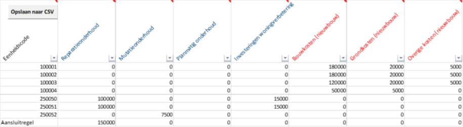

# Stap 1: Download het sjabloon

Download om te beginnen het Sjabloon Aedes-benchmark (Excel). Maak daarmee het csv-bestand met onderhouds- en nieuwbouwkosten (stichtingskosten) per eenheidsniveau. Dit omdat een koppeling met de WOZ-bezitstabel (dVi) op eenheidscode nodig is. Verzamel in het sjabloon de gegevens voor het portaal.

U begint met het opstellen van het Aedes-benchmarktabel (.csv) met behulp van het sjabloon Aedes-benchmark. Met dit bestand levert u per vhe de onderhoudskosten en/of stichtingskosten aan. Nadat u alles heeft ingevuld, gaat u het bestand exporteren als csv-bestand. Hiervoor gebruikt u de knop opslaan naar csv, hiermee wordt het bestand meteen in het juiste csv-format opgeslagen (UTF-8).

## Aandachtspunten

* Informatie in het csv-bestand is op vhe-niveau voor koppeling met de WOZ-bezitstabel (dVi).
*   Het totaal van de onderhoudskosten alle vhe’s moet aansluiten op het totaal van de onderhoudskosten in dVi2024 (W-V), rekening houdend met de toegerekende organisatiekosten. Om eventuele aansluitingsverschillen te voorkomen kunt u in de Aedes-benchmarktabel.csv kosten opnemen onder het type ‘aansluitregel’. 

    <figure><figcaption></figcaption></figure>
* Alleen nieuwbouw en geen onderhoud aanleveren? Gebruik de aansluitregel en vul alle totale onderhoudskosten op één regel in.
* Lever de nieuwbouwgegevens op eenheidsniveau aan. We maken een koppeling met de WOZ-tabel. De WOZ-tabel is leidend. Als in de Abm-tabel meer of minder woningen met bouwkosten worden opgevoerd, neemt de berekening alleen de kosten mee van de woningen in de WOZ-bezitstabel (gematched op eenheidscode). Daarnaast kunnen er ook gegevens afvallen doordat er extreme waarden zijn opgegeven bij bouwjaar of stichtingskosten.
  * Voorbeeld: Stel, Corporatie X heeft 65 nieuwbouwwoningen opgenomen in de WOZ-bezitstabel. In de Abm-tabel zijn voor 60 nieuwbouwwoningen stichtingskosten opgegeven. Na het matchen op eenheidscode blijken 55 woningen overeen te komen. Op basis van deze 55 eenheden worden vervolgens de gemiddelde bouw- en grondkosten berekend.
