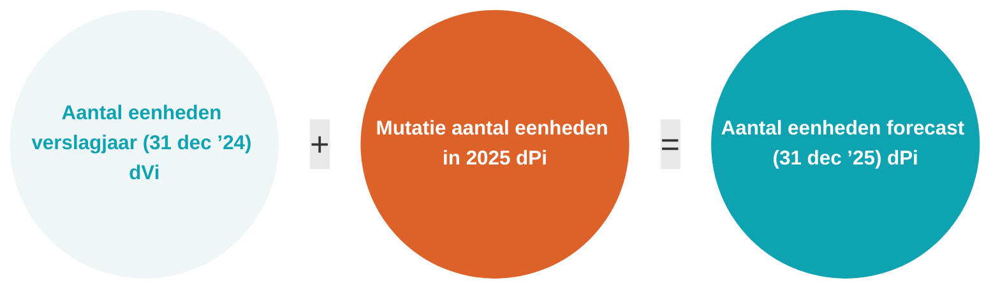

# 1. Algemeen

In dit hoofdstuk vult u algemene gegevens van de woningcorporatie in. Bij gebruik van een xbrl-bestand van uw softwareleverancier worden de gegevens van de corporatie automatisch ingevuld. Als u geen gebruik maakt van een import xbrl-bestand van uw softwareleverancier, vult u bij de invulvelden ‘Naam softwarepakket’ en ‘Versie softwarepakket’ n.v.t. in.

## Onderscheid regimes

Sinds 1 januari 2017 moeten woningcorporaties hun commerciële activiteiten (Niet-DAEB) gescheiden van hun sociale werkzaamheden (DAEB) opnemen in de administratie. Een corporatie heeft bij de scheiding gekozen voor een administratieve scheiding, juridische splitsing, hybride scheiding of een verlicht regime.

Woningcorporaties hebben verschillende mogelijkheden gehad voor het scheiden van DAEB en Niet-DAEB activiteiten. Het gekozen regime heeft invloed op de in te dienen prognose- en verantwoordingsinformatie (dPi en dVi). Bij het selecteren van het invoerformulier in het portaal, moet het juiste formuliertype (entrypoint) geselecteerd worden. De vraag over het regime is belangrijk zodat u de juiste onderdelen te zien krijgt in het portaal van SBR-wonen. In het geval van een geconsolideerde opgaaf, dus inclusief verbindingen (uitgangspunt is verwerking in de jaarrekening), moet hier bij de selectie van het formuliertype in het portaal rekening mee gehouden worden.

Afhankelijk van het gekozen scheidingsregime en de activiteiten binnen een corporatie is er sprake van de volgende niveaus waarop u de dPi invult:

* DAEB TI;
* Niet-DAEB TI;
* Geconsolideerde niet-DAEB verbindingen.

De uitvraag op de verschillende niveaus is gelijk, tenzij in deze toelichting anders is aangegeven. Naast het onderscheid in niveaus, wordt op een aantal onderdelen ook onderscheid gemaakt tussen enkelvoudige en geconsolideerde gegevens van de woningcorporatie. Bij een juridische splitsing zijn de gegevens die u invult op het niveau ‘DAEB TI’ gelijk aan de enkelvoudige gegevens.

Voor alle mogelijke regimes is hieronder weergegeven welke onderdelen u moet invullen. Afhankelijk van het type regime en de vraag of er sprake is van consolidatie verantwoordt u in de **dPi2025** over maximaal 5 verschillende niveaus (DAEB TI, Niet-DAEB TI, enkelvoudig, Geconsolideerde niet-DAEB verbindingen en geconsolideerd).

De volgende afkortingen zijn in dit overzicht gebruikt:\
VR = Verlicht regime;\
AS = Administratieve scheiding;\
HS = Hybride scheiding;\
JS = Juridische splitsing.

Afhankelijk van het regime en of er sprake is van consolidatie zijn bepaalde velden wel of niet van toepassing. Bij hybride scheiding en juridische splitsing is per definitie sprake van consolidatie. Velden die niet van toepassing zijn, worden op basis van de beantwoording van de selectievraag (keuze formuliertype bij creëren/importeren nieuwe rapportage) automatisch geblokkeerd. In onderstaand overzicht staat welke velden niet van toepassing zijn voor de verschillende regimes.

Corporaties met een verlicht regime maken ook onderscheid tussen uitgaven en ontvangsten (kasstroomoverzicht) van DAEB-activiteiten en Niet-DAEB-activiteiten, ondanks dat voor hen een volledige (administratieve) scheiding niet van toepassing is. Het aanleveren van een gesplitste balans is onder het verlicht regime niet van toepassing en wordt derhalve niet in het portaal getoond.

Toepassing van het verlicht regime is alleen mogelijk als u blijvend aan de voorwaarden 1 voldoet. Als u niet meer aan de voorwaarden voldoet en u bent niet in aanmerking gekomen voor de coulance regeling ten tijde van de scheiding, dan moet u alsnog overgaan op een administratieve scheiding of juridische splitsing van de DAEB en Niet-DAEB activiteiten.

Bij het invullen van de dPi gaat u uit van het regime dat op dit moment van toepassing is (zoals is beschikt in een besluit van de Aw), ook als u in een van de prognosejaren verwacht niet meer aan de voorwaarden voor het toepassen van het verlicht regime te voldoen. Neem in die situatie contact op met de inspecteur, bijvoorbeeld via het [Klantcontactcentrum (KCC)](https://www.ilent.nl/service/contact).


Bij het selecteren van het invoerformulier in het portaal, moet het juiste formuliertype (entrypoint) geselecteerd worden. De vraag over het regime is belangrijk zodat u de juiste onderdelen te zien krijgt in het portaal van SBR-wonen. In het geval van een geconsolideerde opgaaf, dus inclusief verbindingen (uitgangspunt is verwerking in de jaarrekening), moet hier bij de selectie van het formuliertype rekening mee gehouden worden.


### Aansluiting aantal vastgoedeenheden dPi versus dVi

Uit de analyses van de voorgaande ingediende dPi’s en dVi’s is geconstateerd dat er inconsistenties in de verantwoording van aantal verhuureenheden tussen dPi en dVi zijn. De woningcorporatie wordt geacht om een goede en consistente aansluiting in verhuureenheden te maken. Hieronder een visuele weergave ten aanzien van consistentie van verhuureenheden.

## Fusies

Is sprake van een fusie die voor 1 april van het eerste prognosejaar wordt gerealiseerd, dan is de dPi een gecombineerde opgave van de organisaties die met elkaar fuseren. Als gevolg hiervan moet u ook de informatie over het huidige verslagjaar (forecastjaar in de dPi) als één gefuseerde weergave in de dPi aanleveren. Voor de beoordeling is het beeld van de (komende) fusiecorporatie relevant.

Vul als algemene gegevens de gegevens van de fusiedrager in. De fusiedrager heeft over het algemeen de benodigde informatie om een gedegen geconsolideerde dPi in te dienen. Neem bij vragen hierover contact op met de [Servicedesk van SBR-wonen](https://servicedesk.sbr-wonen.nl/support/tickets/new).


**Let op**

* De term ‘Huidig’ komt in de headers van diverse tabellen, binnen diverse hoofdstukken, voor. Deze headers hebben geen functie en kunnen derhalve worden genegeerd.
* Alle invulvelden zijn verplicht (mits van toepassing voor uw corporatie) en daarom moet altijd een waarde zijn ingevuld. Indien een invulveld voor uw corporatie niet van toepassing is, dan vult u een 0 in.
* In de tabellen van de hoofdstukken 2.7, 3.4.1 en 4.1 worden percentages uitgevraagd. U dient hier de daadwerkelijke percentages in te vullen. 1% vult u dus als 1 in.

